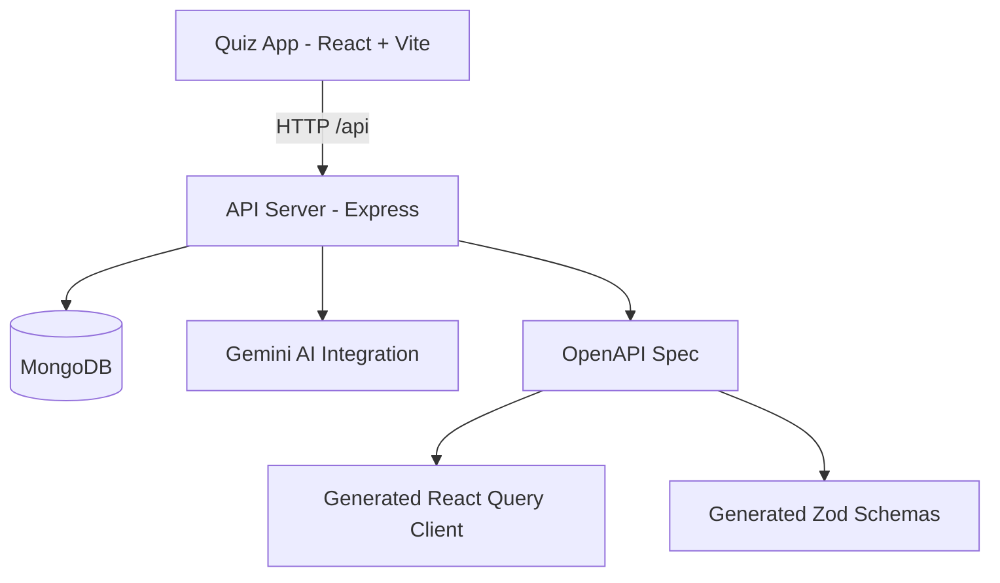

# Quiz Master Hub

A full-stack quiz platform that lets users create quizzes, take them, and track results, with AI-powered quiz generation from topics or PDFs. Built as a TypeScript monorepo with a React + Vite frontend and an Express API server.

## Features

- Secure auth with JWT and user profiles
- Quiz creation and quiz attempts with scoring
- AI quiz generation by topic and difficulty
- PDF-to-quiz generation with file upload limits and validation
- Rate-limited endpoints for auth and AI workloads
- Type-safe API via OpenAPI + Orval + Zod
- React Query powered data fetching and caching

## Architecture



## Monorepo Layout

| Path | Description |
| --- | --- |
| artifacts/api-server | Express API server (builds to dist) |
| artifacts/quiz-app | React frontend (Vite) |
| artifacts/mockup-sandbox | UI prototyping sandbox |
| lib/api-spec | OpenAPI spec and Orval config |
| lib/api-client-react | Generated React Query hooks |
| lib/api-zod | Generated Zod schemas for request validation |
| lib/integrations-gemini-ai | Gemini AI client wrapper |
| lib/db | Drizzle + Postgres scaffold (not wired to API server) |
| scripts | Utility scripts |

## Tech Stack

**Frontend**
- React 19, Vite, Tailwind CSS
- TanStack Query, Wouter, shadcn/ui

**Backend**
- Express 5, Mongoose, JWT auth
- Zod validation, Pino logging
- Express rate limiting, Helmet, CORS

**Tooling**
- TypeScript, pnpm workspaces
- esbuild for API server bundle
- Orval codegen from OpenAPI

## Getting Started

### Prerequisites

- Node.js LTS
- pnpm
- MongoDB instance (local or hosted)
- Gemini AI credentials

### Install

```bash
pnpm install
```

### Configure Environment

Create an .env file in artifacts/api-server.

```bash
PORT=3000
MONGODB_URI=mongodb://localhost:27017/quiz-master-hub
JWT_SECRET=change-me
AI_INTEGRATIONS_GEMINI_API_KEY=your-key
AI_INTEGRATIONS_GEMINI_BASE_URL=https://generativelanguage.googleapis.com/v1beta
FRONTEND_URL=http://localhost:5173
NODE_ENV=development
LOG_LEVEL=info
```

Optional frontend .env in artifacts/quiz-app:

```bash
VITE_API_PROXY_TARGET=http://localhost:3000
BASE_PATH=/
PORT=5173
```

### Run Locally

```bash
pnpm --filter @workspace/api-server run dev
```

```bash
pnpm --filter @workspace/quiz-app run dev
```

Open http://localhost:5173 in your browser.

## Scripts

**Root**
- pnpm run build - typecheck and build all packages
- pnpm run typecheck - typecheck all packages

**API server**
- pnpm --filter @workspace/api-server run dev
- pnpm --filter @workspace/api-server run build
- pnpm --filter @workspace/api-server run start

**Frontend**
- pnpm --filter @workspace/quiz-app run dev
- pnpm --filter @workspace/quiz-app run build
- pnpm --filter @workspace/quiz-app run serve

**API codegen**
- pnpm --filter @workspace/api-spec run codegen

## API Overview

Base path: /api

- GET /healthz - Health check
- POST /auth/register - Register
- POST /auth/login - Login
- GET /auth/me - Current user
- GET /quizzes - List quizzes
- POST /quizzes - Create quiz
- GET /quizzes/:id - Quiz details
- POST /quizzes/:id/submit - Submit attempt
- GET /attempts - List attempts
- GET /attempts/:id - Attempt details
- POST /generate-quiz - AI quiz generation
- POST /quiz/generate-from-pdf - AI quiz generation from PDF

Full spec: lib/api-spec/openapi.yaml

## Data Model (MongoDB)

- User: username, email, password hash
- Quiz: title, description, questions, createdBy, quizType, sourceFileName
- Attempt: quizId, userId, answers, score, totalQuestions, completedAt

## Auth and Storage

- JWT access token stored in localStorage under quiz_token
- Auth middleware protects quiz and attempt endpoints

## Rate Limits

- Auth: 10 requests per 15 minutes
- AI generation: 10 requests per hour
- PDF AI generation: 5 requests per hour
- General API: 300 requests per 15 minutes (health check excluded)

## Build Outputs

- API server bundle: artifacts/api-server/dist
- Frontend build: artifacts/quiz-app/dist/public

## Troubleshooting

- If the API fails to start, ensure all required env vars are set in artifacts/api-server/.env
- If CORS blocks the frontend, verify FRONTEND_URL matches the UI origin
- If AI generation fails, verify Gemini API key and base URL

## License

MIT
