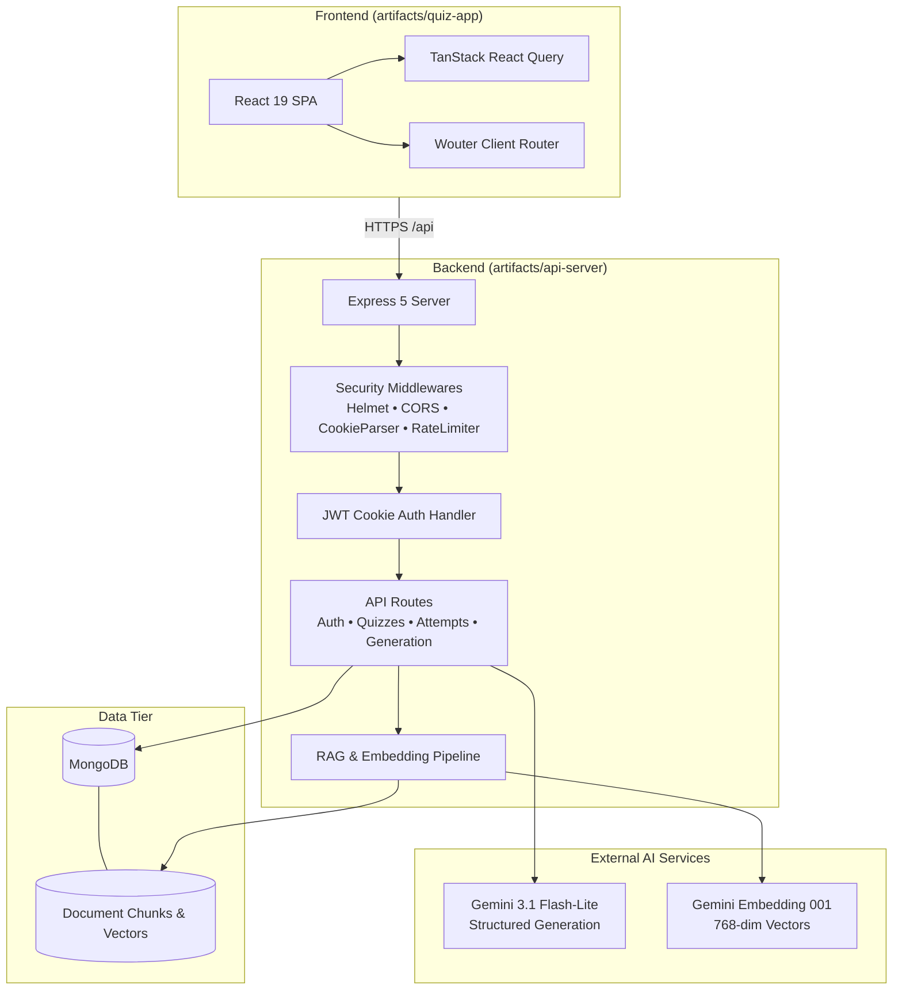

# QuizCraft

[](https://github.com/Pratham-Mishra225/QuizCraft/actions)
[](LICENSE)
[](https://nodejs.org/)
[](https://pnpm.io/)

QuizCraft is a full-stack, AI-assisted quiz platform that combines manual quiz creation, Google Gemini-powered topic generation, and document-grounded quiz generation through a Retrieval-Augmented Generation (RAG) PDF pipeline.

Built as a high-performance TypeScript monorepo, QuizCraft features a React 19 single-page application and an Express 5 backend deployed natively to Render on Node.js 22 LTS.

---

## Key Features

- **Manual Quiz Authoring**: Create custom quizzes with 4 options per question, server-enforced answer bounds, and detailed explanations.
- **AI Topic-Based Generation**: Generate structured quizzes on any topic and difficulty (`easy`, `medium`, `hard`) using Google Gemini (`gemini-3.1-flash-lite`) with structured JSON schema output and deduplication filtering.
- **PDF-to-Quiz RAG Pipeline**: Upload documents up to 5 MB (up to 50 pages) to extract text, generate overlapping chunks, produce vector embeddings (`gemini-embedding-001`), and synthesize grounded quizzes with exact page/chunk source citations.
- **Cookie-Based Authentication**: Secure JWT session management via `HttpOnly`, `SameSite=Lax`, `Secure` cookies (`auth_token`) with bcrypt password hashing (12 salt rounds).
- **Server-Authoritative Scoring & Snapshots**: All answers are scored server-side. Submissions record an immutable `questionSnapshot` guaranteeing that historical attempt reviews remain accurate even if quizzes are subsequently edited or deleted.
- **Public & Private Quiz Sharing**: Share public quizzes via cryptographically random `shareId` URLs (`/quiz/:shareId`) with complete IDOR isolation between creators and participants.
- **Result Review & Attempt History**: Comprehensive review interface displaying question-level correctness, chosen answers, correct answers, explanations, and PDF source citations.
- **Production Hardening & Observability**: Multi-tier rate limiting (`express-rate-limit`), Helmet security headers, origin-restricted CORS, structured Pino logging, and liveness (`/api/healthz`) / readiness (`/api/readyz`) probes.

---

## Architecture

In production, QuizCraft operates as a unified single-service web application on Render. Express serves the REST API endpoints under `/api/*` and delivers the compiled React SPA static bundle with an SPA fallback for client-side routing.

```
+-------------------------------------------------------------------------+
|                               Browser                                   |
+-------------------------------------------------------------------------+
                                     │ HTTPS
                                     ▼
+-------------------------------------------------------------------------+
|                  Render Web Service (Node.js 22 LTS)                     |
|                                                                         |
|  +───────────────────────────────────────────────────────────────────+  |
|  |                       Express 5 Server                            |  |
|  |                                                                   |  |
|  |   ┌───────────────────────────┐   ┌───────────────────────────┐   |  |
|  |   │   Static SPA Middleware   │   │     REST API (/api/*)     │   |  |
|  |   │   (artifacts/quiz-app)    │   │  (artifacts/api-server)   │   |  |
|  |   └─────────────┬─────────────┘   └─────────────┬─────────────┘   |  |
|  +─────────────────┼───────────────────────────────┼─────────────────+  |
+────────────────────┼───────────────────────────────┼────────────────────+
                     │                               │
                     ▼                               ▼
       +───────────────────────────+   +───────────────────────────+
       |     React 19 Frontend     |   |         Database          |
       |  (TanStack Query + Wouter |   |     MongoDB / Mongoose    |
       |     + Tailwind CSS)       |   +───────────────────────────+
       +───────────────────────────+                 │
                                                     ▼
                                       +───────────────────────────+
                                       |      Google Gemini        |
                                       |  - gemini-3.1-flash-lite  |
                                       |  - gemini-embedding-001   |
                                       +───────────────────────────+
```



---

## RAG Pipeline (PDF to Grounded Quiz)

The PDF generation feature uses a multi-stage Retrieval-Augmented Generation pipeline to ensure quiz questions are strictly grounded in document facts and provide verifiable page citations:

```
[ User PDF Upload (≤ 5MB, ≤ 50 Pages) ]
                   │
                   ▼
[ 1. Page-Aware PDF Extraction (pdf-parse) ]
                   │
                   ▼
[ 2. Deterministic Text Cleaning & Normalization ]
                   │
                   ▼
[ 3. Overlapping Chunking (800 chars / 150 overlap) ]
                   │
                   ▼
[ 4. Batch Vector Embedding (gemini-embedding-001, TASK_TYPE_DOCUMENT, 768-dim) ]
                   │
                   ▼
[ 5. Vector Store Ingestion (MongoDB DocumentChunk with { documentId, userId }) ]
                   │
                   ▼
[ 6. Semantic Query Embedding (TASK_TYPE_QUERY) & Cosine Similarity Search ]
                   │
                   ▼
[ 7. Page Diversification (Round-robin selection across page buckets) ]
                   │
                   ▼
[ 8. Gemini Structured Prompting (Strict JSON Schema + Mandatory Chunk Citing) ]
                   │
                   ▼
[ 9. Authoritative Source Validation & Canonical Quiz Persistence ]
```

### RAG Technical Details

1. **Extraction**: `extractPagesFromPdf` parses uploaded buffers into per-page text segments while enforcing `PDF_MAX_PAGES` (default: 50).
2. **Cleaning**: `cleanExtractedPages` strips non-printable ASCII control characters, normalizes Unicode spaces, and collates text density.
3. **Chunking**: `chunkPages` segments text into overlapping windows (default: 800 characters, 150 overlap) while preserving source page numbers and assigning unique `chunkId` identifiers.
4. **Task-Type Embeddings**: Uses `gemini-embedding-001` with explicit task types:
   - `RETRIEVAL_DOCUMENT`: Used when indexing chunks into the vector store.
   - `RETRIEVAL_QUERY`: Used when calculating query embeddings for semantic matching.
   - All vectors are generated with `outputDimensionality: 768`.
5. **IDOR-Isolated Vector Store**: Chunks are stored in MongoDB indexed by `{ documentId: 1, userId: 1 }`, ensuring users can never search or access another user's document vectors.
6. **Vector Search & Page Diversification**: `searchSimilarChunks` computes cosine similarity in-process. `diversifyChunks` applies round-robin selection across page buckets to avoid clustering questions on a single page of the document.
7. **Authoritative Citation Mapping**: Gemini is prompted with strict JSON schemas requiring each generated question to return the source `chunkId`. The backend verifies returned chunk IDs against the retrieved set and authoritatively binds the exact `documentId`, `chunkId`, and `pageNumber` into the quiz question.

---

## Authentication & Security Model

QuizCraft uses a defense-in-depth security approach designed for modern single-page applications:

### 1. Authentication Flow
- **HttpOnly Cookies**: On `POST /api/auth/login` or `POST /api/auth/register`, the server sets an `auth_token` cookie containing a signed JWT.
- **No Client Storage**: JavaScript cannot access the JWT, eliminating token exfiltration via Cross-Site Scripting (XSS).
- **Cookie Security Attributes**:
  - `httpOnly: true` (XSS prevention)
  - `secure: true` in production (enforces HTTPS)
  - `sameSite: "lax"` (Cross-Site Request Forgery protection for state-changing requests)
  - `maxAge` synchronized with `AUTH_TOKEN_TTL` (default: 7 days)
- **Safe Logout**: `POST /api/auth/logout` clears the cookie on the response with identical path and security flags.

### 2. Authorization & IDOR Prevention
- **Authentication vs. Authorization**: Authentication identifies *who* the caller is (`req.userId`); authorization verifies *ownership* before performing operations.
- **Strict Query Scoping**: All database modifications and private reads explicitly include `{ createdBy: req.userId }` or `{ userId: req.userId }`.
- **Safe 404s**: Accessing a resource owned by another user returns `404 Not Found` rather than `403 Forbidden` to prevent object existence enumeration.
- **ObjectId Guarding**: Request handlers validate `Types.ObjectId.isValid(id)` before querying Mongoose, preventing unhandled `CastError` exceptions.

### 3. Server-Authoritative Scoring
- Clients submit only answer indices: `[{ questionIndex: 0, selectedOption: 2 }, ...]`.
- The server validates that all questions are answered exactly once and indices are within bounds.
- Scores and correctness flags are computed exclusively by the server against the database record.
- Submissions snapshot the entire question state into `Attempt.questionSnapshot`, preserving historical accuracy if the source quiz is subsequently edited or deleted.

### 4. Edge & Middleware Protections
- **Helmet**: Sets security headers including `X-Content-Type-Options`, `X-Frame-Options`, and `Strict-Transport-Security`.
- **CORS**: Strict origin validation matching `FRONTEND_URL` with `credentials: true`.
- **Tiered Rate Limiting**:
  - `authLimiter`: 10 requests per 15 minutes per IP
  - `aiLimiter`: 10 requests per hour per IP
  - `pdfAiLimiter`: 5 requests per hour per IP
  - `generalApiLimiter`: 300 requests per 15 minutes per IP (health endpoints excluded)

---

## Monorepo Layout

```
QuizCraft/
├── artifacts/
│   ├── api-server/             # Express 5 API server application
│   │   ├── src/
│   │   │   ├── config/         # Zod-validated environment config
│   │   │   ├── db/             # MongoDB connection lifecycle
│   │   │   ├── middlewares/    # Auth, rate limiting, error handling
│   │   │   ├── models/         # Mongoose models (User, Quiz, Attempt, Document, Chunk)
│   │   │   ├── routes/         # Express route controllers
│   │   │   ├── schemas/        # Zod request validation schemas
│   │   │   ├── services/       # PDF parsing, embeddings, RAG retrieval
│   │   │   └── __tests__/      # Security & integration test suite
│   │   ├── build.mjs           # esbuild compilation script
│   │   └── package.json
│   ├── quiz-app/               # React 19 + Vite frontend application
│   │   ├── src/
│   │   │   ├── components/     # UI components (shadcn/ui + Tailwind)
│   │   │   ├── hooks/          # React hooks & auth state
│   │   │   ├── pages/          # Application views (home, auth, quiz, results)
│   │   │   └── App.tsx         # Root component & Wouter routing
│   │   ├── vite.config.ts      # Vite bundler configuration
│   │   └── package.json
│   └── mockup-sandbox/         # UI prototyping sandbox
├── lib/
│   ├── api-client-react/       # Generated React Query hooks
│   ├── api-spec/               # OpenAPI specification and Orval configuration
│   ├── api-zod/                # Shared Zod validation schemas
│   └── integrations-gemini-ai/ # Google GenAI SDK wrapper and error formatting
├── docs/                       # Architecture and database documentation
├── .github/
│   └── workflows/
│       └── ci.yml              # GitHub Actions CI pipeline
├── render.yaml                 # Render Infrastructure-as-Code blueprint
├── pnpm-workspace.yaml         # pnpm workspace definition
└── package.json                # Workspace root package.json
```

---

## Local Development

### Prerequisites

- **Node.js**: `22.x` (v22.17.1 LTS recommended)
- **pnpm**: `11.x` (`11.1.1` recommended)
- **MongoDB**: Local MongoDB instance (`mongodb://localhost:27017`) or MongoDB Atlas cluster URI
- **Google Gemini API Key**: From [Google AI Studio](https://aistudio.google.com/)

### 1. Installation

Clone the repository and install all monorepo dependencies:

```bash
git clone https://github.com/Pratham-Mishra225/QuizCraft.git
cd QuizCraft
pnpm install
```

### 2. Configure Environment Variables

Create `.env` in `artifacts/api-server/` (see `artifacts/api-server/.env.example`):

```bash
# Server & Runtime
PORT=3000
NODE_ENV=development
LOG_LEVEL=info
FRONTEND_URL=http://localhost:5173

# Database
MONGODB_URI=mongodb://localhost:27017/quizcraft

# Authentication
JWT_SECRET=your-secure-random-256-bit-secret-min-32-chars
AUTH_TOKEN_TTL=7d

# Google Gemini AI Integration
AI_INTEGRATIONS_GEMINI_API_KEY=your-gemini-api-key
AI_INTEGRATIONS_GEMINI_BASE_URL=https://generativelanguage.googleapis.com

# RAG & PDF Pipeline Settings (Optional defaults shown)
EMBEDDING_MODEL=gemini-embedding-001
RAG_TOP_K=5
RAG_CHUNK_SIZE=800
RAG_CHUNK_OVERLAP=150
PDF_MAX_PAGES=50
```

### 3. Running Locally

Start the backend API server and frontend development server:

```bash
# Terminal 1: Backend API (runs on port 3000)
pnpm --filter @workspace/api-server run dev

# Terminal 2: Frontend SPA (runs on port 5173)
pnpm --filter @workspace/quiz-app run dev
```

Open `http://localhost:5173` in your browser. The Vite development server proxies API requests to `http://localhost:3000`.

### 4. Workspace Commands

| Command | Description |
|---|---|
| `pnpm run typecheck` | Typechecks all packages (`tsc -p tsconfig.json --noEmit`) |
| `pnpm run build` | Runs typecheck, bundles backend (`esbuild`), and builds frontend (`vite`) |
| `pnpm test` | Runs the backend integration test suite (`vitest run`) |
| `pnpm --filter @workspace/api-server run build` | Builds backend to `artifacts/api-server/dist/` |
| `pnpm --filter @workspace/quiz-app run build` | Builds frontend to `artifacts/quiz-app/dist/public/` |
| `pnpm --filter @workspace/api-spec run codegen` | Regenerates Zod schemas and React Query hooks from OpenAPI spec |

---

## Production Deployment (Render Native Node)

QuizCraft is deployed on **Render** as a single native Node.js web service without Docker.

```
GitHub Push (main)
       │
       ▼
GitHub Actions CI (Typecheck → Test → Build)
       │
       ▼
Render Web Service Auto-Deploy
       │
       ├── Build: pnpm install --frozen-lockfile && pnpm run build
       └── Start: node --enable-source-maps artifacts/api-server/dist/index.mjs
```

### Render Configuration (`render.yaml`)

- **Runtime**: `node` (Node 22 LTS)
- **Plan**: `free` (or standard for production)
- **Build Command**: `pnpm install --frozen-lockfile && pnpm run build`
- **Start Command**: `node --enable-source-maps artifacts/api-server/dist/index.mjs`
- **Health Check Path**: `/api/healthz` (returns `200 OK` when alive)

### Required Render Environment Variables

Configure these in the **Render Dashboard → Environment** (never commit secret values):

| Variable | Required | Description / Example |
|---|---|---|
| `NODE_ENV` | Yes | `production` |
| `MONGODB_URI` | Yes | MongoDB Atlas connection string |
| `JWT_SECRET` | Yes | Cryptographically secure 256-bit string (32+ chars) |
| `AI_INTEGRATIONS_GEMINI_API_KEY` | Yes | Google Gemini API key |
| `AI_INTEGRATIONS_GEMINI_BASE_URL` | Yes | `https://generativelanguage.googleapis.com` |
| `FRONTEND_URL` | Yes | Production URL (e.g. `https://quizcraft.onrender.com`) |
| `AUTH_TOKEN_TTL` | No | Default `7d` |
| `EMBEDDING_MODEL` | No | Default `gemini-embedding-001` |
| `LOG_LEVEL` | No | Default `info` |

> **Note**: `PORT` is assigned dynamically by Render at runtime.

---

## API Reference Overview

All API endpoints are mounted under `/api`.

### Health & Diagnostics
| Method | Path | Auth | Description |
|---|---|---|---|
| `GET` | `/api/healthz` | Public | Liveness probe (returns `{ status: "ok" }`) |
| `GET` | `/api/readyz` | Public | Readiness probe (verifies MongoDB connection state) |
| `GET` | `/api/healthz/gemini` | Public | Diagnostic probe for Gemini connectivity |

### Authentication
| Method | Path | Auth | Description |
|---|---|---|---|
| `POST` | `/api/auth/register` | Public (Rate-limited) | Register user and set `auth_token` cookie |
| `POST` | `/api/auth/login` | Public (Rate-limited) | Authenticate user and set `auth_token` cookie |
| `POST` | `/api/auth/logout` | Public | Clear `auth_token` cookie |
| `GET` | `/api/auth/me` | Required | Retrieve currently authenticated user profile |

### Quizzes
| Method | Path | Auth | Description |
|---|---|---|---|
| `GET` | `/api/quizzes` | Required | List all quizzes created by the authenticated user |
| `POST` | `/api/quizzes` | Required | Create a new quiz |
| `GET` | `/api/quizzes/:id` | Required | Get quiz details by ID (owner-only) |
| `PUT` | `/api/quizzes/:id` | Required | Update a quiz (owner-only) |
| `PATCH` | `/api/quizzes/:id/visibility` | Required | Toggle quiz visibility between `private` and `public` |
| `DELETE` | `/api/quizzes/:id` | Required | Delete a quiz (owner-only; preserves past attempts) |
| `POST` | `/api/quizzes/:id/submit` | Required | Submit answers for server-side scoring & attempt creation |

### Public Quizzes & Sharing
| Method | Path | Auth | Description |
|---|---|---|---|
| `GET` | `/api/public/quizzes/:shareId` | Required | Retrieve a public quiz by its `shareId` token |

### Attempts & Result Review
| Method | Path | Auth | Description |
|---|---|---|---|
| `GET` | `/api/attempts` | Required | List all quiz attempts completed by authenticated user |
| `GET` | `/api/attempts/:id` | Required | Get attempt details and question snapshot (owner-only) |

### AI Generation & RAG
| Method | Path | Auth | Description |
|---|---|---|---|
| `POST` | `/api/generate-quiz` | Required (Rate-limited) | Generate quiz questions from topic and difficulty |
| `POST` | `/api/quiz/generate-from-pdf` | Required (Rate-limited) | Upload PDF (multipart) and generate grounded quiz via RAG |

For complete schemas, consult `lib/api-spec/openapi.yaml` and `docs/DATABASE_INDEXES.md`.

---

## Engineering Decisions

1. **Unified Single-Service Web Architecture**:
   - In production, Express statically serves the built React SPA alongside the API. This eliminates cross-origin latency, avoids pre-flight CORS overhead on same-origin calls, and simplifies deployment onto a single Render instance.
2. **HttpOnly Cookie Authentication**:
   - Moving from `localStorage` bearer tokens to `HttpOnly`, `SameSite=Lax` cookies prevents client-side script token theft via XSS while mitigating cross-site request forgery on browser navigation.
3. **Server-Authoritative Scoring & Immutable Snapshots**:
   - Scoring calculations, correctness checks, and total points are evaluated strictly on the backend. Creating an immutable `questionSnapshot` on each `Attempt` guarantees that historical attempt reviews remain accurate regardless of subsequent quiz revisions or deletions.
4. **In-Memory Cosine Similarity with Compound Indexing**:
   - For typical single-document PDF quiz generation (up to 50 pages / ~100–300 chunks), in-memory cosine similarity against document-scoped chunks fetched via `{ documentId: 1, userId: 1 }` avoids the operational complexity and cost of external vector databases while guaranteeing absolute tenant isolation.
5. **Shared Type Contracts via Workspace Packages**:
   - OpenAPI specifications in `lib/api-spec` drive automated code generation of React Query client hooks (`lib/api-client-react`) and Zod validation schemas (`lib/api-zod`), ensuring end-to-end type safety between database models, backend validators, and frontend components.

---

## Testing Status

The repository contains an automated integration and security test suite located in `artifacts/api-server/src/__tests__/security.test.ts`.

These tests validate:
- Authentication & registration flows (cookie attributes, invalid credentials, token expiry)
- IDOR protections across quizzes, attempts, and public share links
- Submission validation, boundary checks, duplicate prevention, and server-side scoring
- Historical attempt snapshot resilience upon quiz modification and deletion
- RAG pipeline units (text cleaning, overlapping chunking, vector cosine similarity math)
- Vector store user isolation and PDF generation route security

> **Status Notice**: The dedicated **Stage 12 Testing Phase** (including comprehensive unit test matrices, component testing, and full code-coverage reporting) is currently pending implementation. The existing integration tests verify security and core business logic.

---

## Known Considerations & Future Work

- **Frontend Bundle Size**: Production builds generate a single main bundle chunk (~570 kB minified). Future optimizations will implement dynamic `React.lazy()` route-based code splitting.
- **Dedicated Stage 12 Testing Matrix**: Expanding test coverage to include comprehensive frontend component unit tests, mocking AI endpoints with deterministic fixtures, and CI coverage thresholds.
- **Background Document Ingestion**: For documents exceeding 50 pages, migrating the synchronous PDF RAG route to an asynchronous job queue (e.g. BullMQ/Redis) with server-sent events for progress tracking.

---

## License

This project is licensed under the [MIT License](LICENSE).  
Copyright © 2026 Pratham Mishra.
