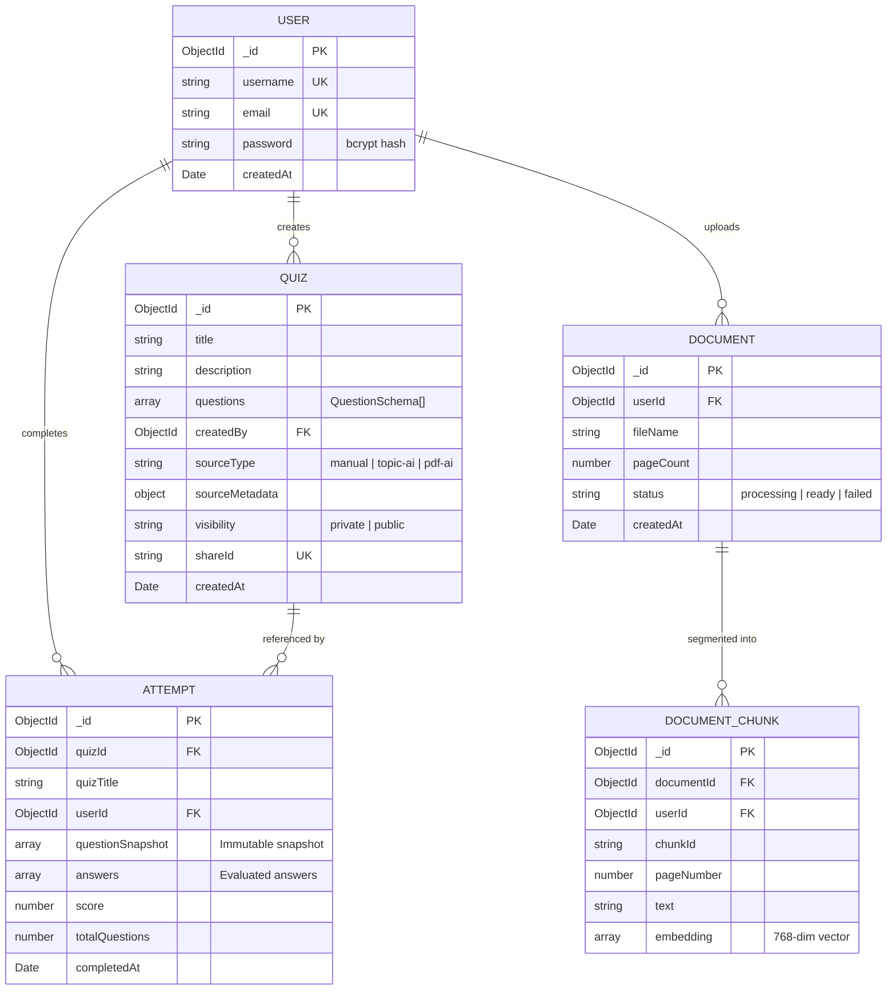
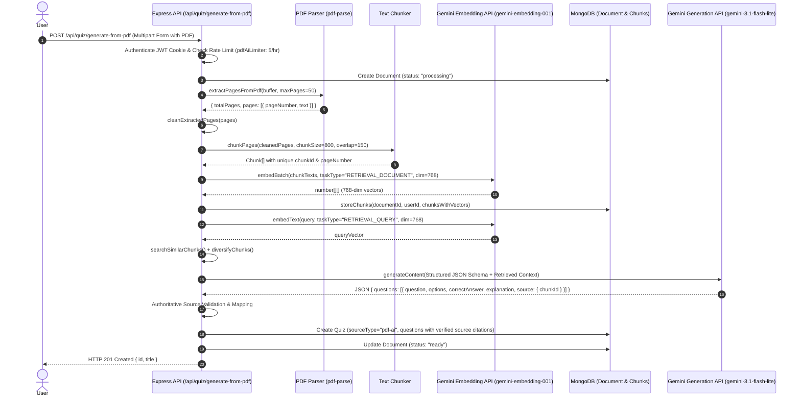
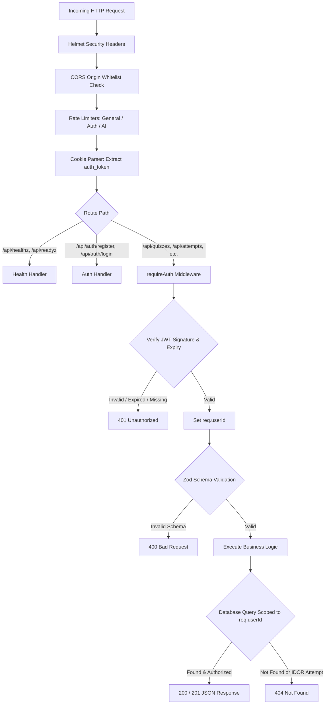

# QuizCraft Architecture & Technical Design

This document details the system design, data architecture, security boundaries, and retrieval-augmented generation (RAG) pipeline of QuizCraft.

---

## 1. System Overview & Deployment Topology

QuizCraft is built as a unified TypeScript monorepo using pnpm workspaces. In production on Render, a single Node.js process runs the Express server, which hosts both the REST API and the compiled React SPA static assets.

```
                      ┌─────────────────────────────────────────┐
                      │                 Browser                 │
                      └────────────────────┬────────────────────┘
                                           │ HTTPS (TLS 1.3)
                                           ▼
                      ┌─────────────────────────────────────────┐
                      │          Render Cloud Service           │
                      │          (Native Node.js 22)            │
                      │                                         │
                      │  ┌───────────────────────────────────┐  │
                      │  │         Express 5 Server          │  │
                      │  │                                   │  │
                      │  │  ┌─────────────┐ ┌─────────────┐  │  │
                      │  │  │  React SPA  │ │  REST API   │  │  │
                      │  │  │ Static Dist │ │   /api/*    │  │  │
                      │  │  └─────────────┘ └──────┬──────┘  │  │
                      │  └─────────────────────────┼─────────┘  │
                      └────────────────────────────┼────────────┘
                                                   │
                            ┌──────────────────────┴──────────────────────┐
                            │                                             │
                            ▼                                             ▼
                 ┌────────────────────┐                        ┌────────────────────┐
                 │   MongoDB Atlas    │                        │  Google Gemini AI  │
                 │   - Users          │                        │  - Flash 3.1-Lite  │
                 │   - Quizzes        │                        │  - Embedding-001   │
                 │   - Attempts       │                        └────────────────────┘
                 │   - Documents      │
                 │   - Chunks         │
                 └────────────────────┘
```

---

## 2. Core Monorepo Packages

The monorepo separates concerns across frontend, backend, shared types, and external integrations:

| Workspace Path | Package Name | Responsibility |
|---|---|---|
| `artifacts/api-server` | `@workspace/api-server` | Express 5 API application, Mongoose models, security middlewares, RAG pipeline, and build bundle (`esbuild`). |
| `artifacts/quiz-app` | `@workspace/quiz-app` | React 19 single-page application built with Vite, Tailwind CSS, TanStack Query, and Wouter. |
| `artifacts/mockup-sandbox` | `@workspace/mockup-sandbox` | Component prototyping environment. |
| `lib/api-spec` | `@workspace/api-spec` | Authoritative OpenAPI 3.0 specification (`openapi.yaml`) and Orval codegen configuration. |
| `lib/api-zod` | `@workspace/api-zod` | Generated Zod validation schemas for request bodies, query parameters, and API responses. |
| `lib/api-client-react` | `@workspace/api-client-react` | Generated React Query hooks providing type-safe API communication in the frontend. |
| `lib/integrations-gemini-ai` | `@workspace/integrations-gemini-ai` | Official `@google/genai` client wrapper with centralized error formatting and retry helpers. |

---

## 3. Data Models & Schemas

The database uses MongoDB with Mongoose ODM. Schemas are designed for high read throughput, strict tenant isolation, and audit immutability.



### Key Schema Design Decisions

1. **Immutable Historical Snapshotting (`Attempt.questionSnapshot`)**:
   - When a quiz is submitted, the server copies all question data, options, correct answers, explanations, and source citations directly into the `Attempt` record.
   - If the creator later edits questions or deletes the original `Quiz`, historical attempts remain completely intact and reviewable with 100% fidelity.
2. **Cryptographic Share IDs (`Quiz.shareId`)**:
   - Generated via `crypto.randomBytes(12).toString("base64url")`.
   - Allows sharing quizzes publicly without exposing internal MongoDB `ObjectId` identifiers.
3. **Compound Indexes for Query Optimization**:
   - `Quiz`: `{ createdBy: 1, createdAt: -1 }` avoids in-memory sorts for creator dashboards.
   - `Attempt`: `{ userId: 1, completedAt: -1 }` optimizes user history retrieval.
   - `DocumentChunk`: `{ documentId: 1, userId: 1 }` isolates chunk retrieval strictly to the authenticated document owner.

---

## 4. Retrieval-Augmented Generation (RAG) Architecture

The PDF-to-quiz pipeline converts unstructured PDF documents into grounded, cited multiple-choice quizzes.



### Mathematical Formulation of Vector Search

For a query embedding vector $\mathbf{q} \in \mathbb{R}^{768}$ and a document chunk embedding $\mathbf{d} \in \mathbb{R}^{768}$, the semantic relevance score is calculated via cosine similarity:

$$\text{Cosine Similarity}(\mathbf{q}, \mathbf{d}) = \frac{\mathbf{q} \cdot \mathbf{d}}{\|\mathbf{q}\|_2 \|\mathbf{d}\|_2} = \frac{\sum_{i=1}^{768} q_i d_i}{\sqrt{\sum_{i=1}^{768} q_i^2} \sqrt{\sum_{i=1}^{768} d_i^2}}$$

- **Page Diversification Algorithm**: Chunks with high scores are grouped into page buckets. A round-robin selection takes top candidates across different pages to prevent the generated quiz from focusing on a single section of the document.

---

## 5. Security & Request Lifecycle



---

## 6. Observability & Reliability

1. **Structured Logging (`pino`)**:
   - JSON structured output in production (`LOG_LEVEL=info`).
   - Human-readable formatting via `pino-pretty` in development.
   - Automatic HTTP request/response serialization with duration tracking.
2. **Process Lifecycle & Signal Handling**:
   - Listens for `SIGTERM` and `SIGINT`.
   - Stops receiving new HTTP traffic and awaits in-flight requests.
   - Closes MongoDB connection cleanly before exiting.
   - Failsafe 10-second timeout forces exit if connections hang.
3. **Health & Readiness Endpoints**:
   - `/api/healthz`: Liveness probe for load balancer health checking.
   - `/api/readyz`: Readiness probe asserting active MongoDB connection state (`mongoose.connection.readyState === 1`).
   - `/api/healthz/gemini`: Diagnostic probe verifying Gemini API connectivity and credentials.
